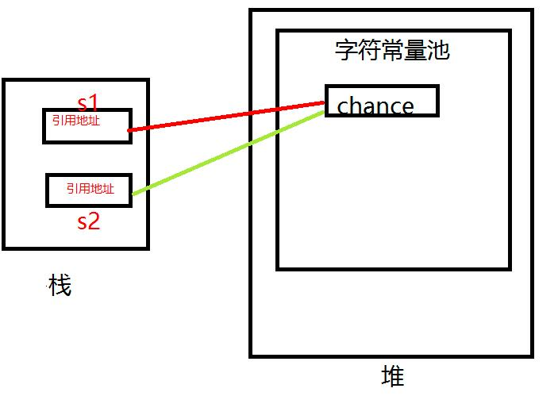
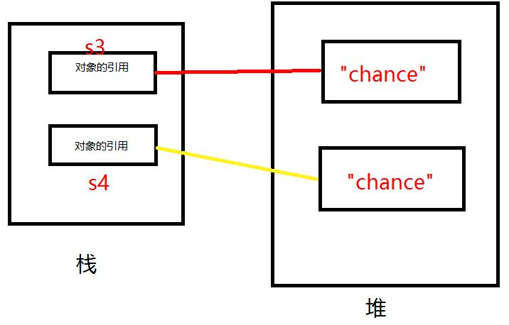
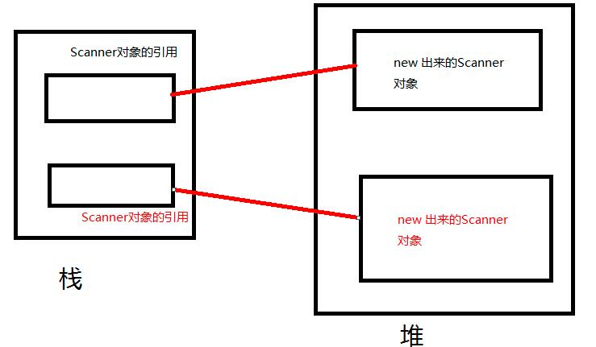
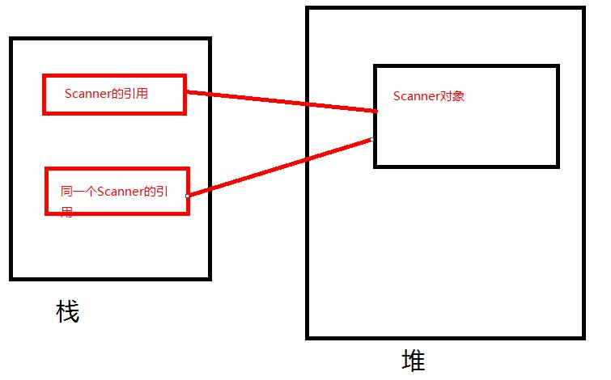
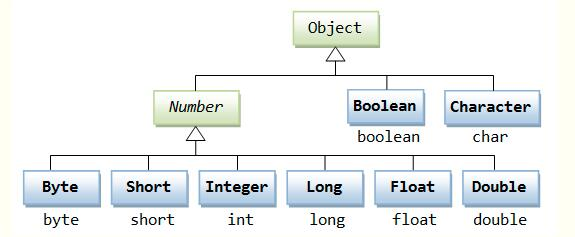
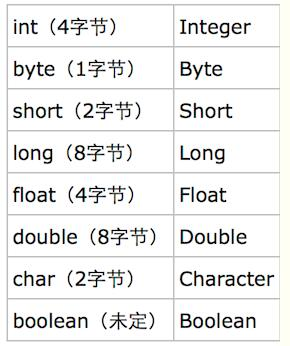
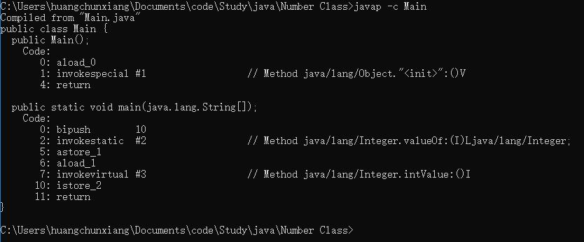
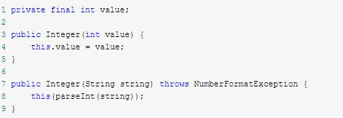

#java中的装箱和拆箱

[toc]

> 在非静态方法中，aload_0 表示对this的操作，在static 方法中，aload_0表示对方法的第一参数的操作。

##equals()和==
### ==
一、 ==在基本数据类型和引用数据类型中有不同含义：
1. 基本数据类型（也叫做原始数据类型）：byte,short,char,int,long,float,double,boolean。他们之间的比较，应用双等号（==）,比较的是他们的值。
如：
```java
int num1 = 10;
int num2 = 10;
System.out.println(num1 == num2); 
```
输出结果：true。
num1 和num2都是int型 它们的值都是10,因此使用”==”当然相等.
2. 引用数据类型：当他们用（==）进行比较的时候，比较的是他们在内存中的存放地址（确切的说，是堆内存地址）。
 
###equals()
equals()方法主要用于比较两个目标是否属于同一个对象，但是在String类中的equals方法被重写成了比较两个对象中对象的内容是否相等。


### 在string类中的比较
1. 不new string类对象时的比较：
```java
String s1 = "chance";
String s2 = "chance";
System.out.println(s1 == s2);        //true
System.out.println(s1.equals(s2));    //true
```
详细分析一下上面这块代码：
* 当执行String s1 = “chance”;这条语句时,会在**堆**中**字符常量池**里找”chance”这个字符串,若没有找到,则将”chance”这个字符串放入字符串常量池中。而在**栈**中开辟一块用于存放引用地址的内存s2,存放”chance”这块空间的引用。
* 当执行String s2 = “chance”;这条语句时,会在堆中的字符串常量池里找”chance”这个字符串,很显然,可以找到,于是在**栈**中开辟一块用于存放引用地址的内存s2，并把字符常量池里”chance”这个字符串的引用地址赋给s2,因此s1与s2存放的都是堆中字符常量池中的同一个”chance”的引用。

2. new string类的比较
```java
String s3 = new String("chance");
String s4 = new String("chance");
System.out.println(s3 == s4);        //false
System.out.println(s3.equals(s4));    //true
```
详细分析一下上面这块代码：
* 当程序执行String s3 = new String(“chance”); 这一句时,会在**堆**（这里不是字符常量池）内存中开辟一块空间用于存放”chance”这一字符串.并在栈中开辟一块名为s3的内存空间存放堆中刚刚创建的”chance”对象的引用.
* 程序执行String s4 = new String(“chance”); 这句时,会在堆内存中开辟另一块空间用于存放”chance”这一字符串,并在栈中开辟一块名为s4的内存空间存放堆中刚刚创建的”chance”对象的引用. 
* 因为s3和s4中存放的是两个不同对象的引用,自然System.out.println(s3 == s4); 返回的是false; 
* 因为还是String类 因此equals方法比较的还是字符串中内容是否相等,即每个字符是否相等。可见s3和s4这两个对象中中存放都是”chance”,自然每个字符都相等. 


总结：**String类中的equals方法被重写成了比较两个对象中对象的内容是否相等。**

###eqaual()方法源码分析

eqaual()方法源码：
```java
 public boolean equals(Object anObject) {
        if (this == anObject) {
            return true;
        }
        if (anObject instanceof String) {
            String anotherString = (String) anObject;
            int n = value.length;
            if (n == anotherString.value.length) {
                char v1[] = value;
                char v2[] = anotherString.value;
                int i = 0;
                while (n-- != 0) {
                    if (v1[i] != v2[i])
                            return false;
                    i++;
                }
                return true;
            }
        }
        return false;
    }
```
该方法将两个String对象拆分成字符数组,然后通过遍历字符数组中的每一个字符是否都相等,若相等,则返回true 否则返回false;
>  instanceof(对象运算符)：对象运算符用来测定一个对象是否属于某个指定类或指定的子类的实例。。

我们查看一般对象的equals方法,可以得知其方法体如下:
```java
 public boolean equals(Object obj) {
        return (this == obj);
 }
```
三行代码,判断的就是两个对象是否属于一个对象。

实列：
```java
Scanner scanner = new Scanner(System.in);      
Scanner scanner2 = new Scanner(System.in);
System.out.println(scanner.equals(scanner2));       //false
Scanner sc = scanner;
System.out.println(scanner.equals(sc));            //true
```
* 执行第一条语句Scanner scanner = new Scanner(System.in); 时在堆中开辟了一块内存存放Scanner对象,在栈内存中开辟一块名为scanenr的内存存放Scanner对象的引用.
* 执行第二条语句Scanner scanner2 = new Scanner(System.in); 时时在堆中另外开辟了一块内存存放Scanner对象,在栈内存中开辟一块名为scanenr2的内存存放Scanner对象的引用. 

* 因为这里调用的是一般对象的equals方法,因此比较的是两个对象是否属于同一个对象,显然不是同一个对象. 
* 至于最后一个Scanner sc = scanner;则将scanner对象的引用复制给sc因此,sc和scanner指向都是堆中同一个Scanner对象,自然比较的都是相等的. 

**总结：**
 1. 在非String类中, == 和 equals 的作用都是一样的，都是判断两个目标是否属于通一个对象，只不过在String类中重写了equals方法,才会变得这么复杂。
 2. 比较两个对象是否相等，我们采用equals()方法，判断两个对象是否相等的条件是由我们重写equals()方法的实现后定义的，这样就可以比较灵活地使用equals()方法在不同的类里面比较位于同一类下的两个对象是否相等了。（https://www.cnblogs.com/xdp-gacl/p/3637073.html）

##自动装箱和拆箱(Autoboxing and unboxing)
> https://www.cnblogs.com/wang-yaz/p/8516151.html

**装箱**就是自动将基本数据类型转换为包装器类型；**拆箱**就是自动将包装器类型转换为基本数据类型.




例如：
```java
public class Main {
    public static void main(String[] args) {
    //自动装箱
    Integer total = 99;
    //自定拆箱
    int totalprim = total;
    }
}
```
反编译class文件后得到如下内容：
`javap -c Main`

分析具体代码如下：
`Integer total = 99;`
执行这句代码的时候，系统为我们执行了：
`Integer total = Integer.valueOf(99);`

`int totalprim = total; `
执行上面那句代码的时候，系统为我们执行了：
`int totalprim = total.intValue();`

我们以Integer为例，来分析一下它的源码：
1. 首先来看看**Integer.valueOf**函数
```java
public static Integer valueOf(int i) {
	return  i >= 128 || i < -128 ? new Integer(i) : SMALL_VALUES[i + 128];
}
```
它会首先判断i的大小：如果i小于-128或者大于等于128，就创建一个Integer对象，否则执行SMALL_VALUES[i + 128]。
 * 来看看Integer的构造函数：

它里面定义了一个value变量，创建一个Integer对象，就会给这个变量初始化。第二个传入的是一个String变量，它会先把它转换成一个int值，然后进行初始化。
 * 下面看看SMALL_VALUES[i + 128]是什么东西：
`private static final Integer[] SMALL_VALUES = new Integer[256];`
它是一个静态的Integer数组对象，也就是说最终valueOf返回的都是一个Integer对象。
所以我们这里可以总结一点：**装箱的过程会创建对应的对象，这个会消耗内存，所以装箱的过程会增加内存的消耗，影响性能。**
2. 接着看看**Integer.intValue**函数
```java
@Override
public int intValue() {
return value;
}
```
这个很简单，直接返回value值即可。

###不同数据类型valueOf方法的返回值
数据进行自动装箱后，就会生成一个对象，不同类型数据对象生成的对象会有一定差异（如上述的Integer类型数据装箱，对于–128到127（默认是127）之间的值,被装箱后，会被放在内存里进行重用，但是如果超出了这个值,系统会重新new一个对象），所以这里做如下总结：
1. Integer派别：Integer、Short、Byte、Character、Long这几个类的valueOf方法的实现是类似的。 
| 类型 | 相同对象范围 |不同对象范围|
|--------|--------|--------|
|Integer|[-128,127]|(-∞，-128) ∪ [128,+∞)|
|Short|[-128,127]|(-∞，-128) ∪ [128,+∞)|
|Character|c < 128|c >= 128|
|Long|[-128,127]|(-∞，-128) ∪ [128,+∞)|
2. Double派别：Double、Float的valueOf方法的实现是类似的。每次都返回不同的对象。
3. Boolean派别:boolean
Boolean型valueOf函数原型：
```java
public static Boolean valueOf(boolean b) {
	return b ? Boolean.TRUE : Boolean.FALSE;
}
```
可以看到它并没有创建对象，因为在内部已经提前创建好两个对象，因为它只有两种情况，这样也是为了避免重复创建太多的对象。两个对象的定义如下：
```java
public static final Boolean TRUE = new Boolean(true);
public static final Boolean FALSE = new Boolean(false);
```


