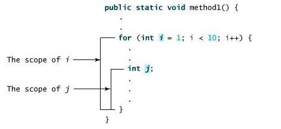

#java方法
[toc]

##什么是方法
Java方法是语句的集合，它们在一起执行一个功能。
* 方法是解决一类问题的步骤的有序组合
* 方法包含于类或对象中
* 方法在程序中被创建，在其他地方被引用

使用方法的优点
* 使程序变得更简短而清晰。
* 有利于程序维护。
* 可以提高程序开发的效率。
* 提高了代码的重用性。

##方法的定义
一般情况下，定义一个方法包含以下语法：
```java
修饰符 返回值类型 方法名(参数类型 参数名){
    ...
    方法体
    ...
    return 返回值;
}
```
方法包含一个方法头和一个方法体。下面是一个方法的所有部分：
1. **修饰符**：修饰符，这是可选的，告诉编译器如何调用该方法。定义了该方法的访问类型。
2. **返回值类型 **：方法可能会返回值。returnValueType 是方法返回值的数据类型。有些方法执行所需的操作，但没有返回值。在这种情况下，returnValueType 是关键字void。
3. **方法名**：是方法的实际名称。方法名和参数表共同构成方法签名。
>方法的命名规则：
>* 方法的名字的第一个单词应以小写字母作为开头，后面的单词则用大写字母开头写，不使用连接符。例如：addPerson。
>* 下划线可能出现在 JUnit 测试方法名称中用以分隔名称的逻辑组件。一个典型的模式是：test<MethodUnderTest>_<state>，例如 testPop_emptyStack。
4. **参数类型**：参数像是一个占位符。当方法被调用时，传递值给参数。这个值被称为实参或变量。参数列表是指方法的参数类型、顺序和参数的个数。参数是可选的，方法可以不包含任何参数。
5. **方法体**：方法体包含具体的语句，定义该方法的功能。

**注意1**： 在一些其它语言中方法指过程和函数。一个返回非void类型返回值的方法称为函数；一个返回void类型返回值的方法叫做过程。

**注意2**：main 方法的头部是不变的，具体如下：
```java
public static void main(String[] args){...}
```

##方法调用
当程序调用一个方法时，程序的控制权交给了被调用的方法。当被调用方法的返回语句执行或者到达方法体闭括号时候交还控制权给程序。

Java 支持两种调用方法的方式，根据方法是否返回值来选择:
1. 方法有返回值时,方法调用通常被当作一个值：
```java
int larger = max(30, 40);
```
2. 如果方法没有返回值（即返回void类型），方法调用如下：
```java
System.out.println("Hello World！");
```

##方法的重载
一个类的两个方法拥有相同的名字，但是有不同的参数列表,Java编译器根据方法签名判断哪个方法应该被调用。

方法重载可以让程序更清晰易读。执行密切相关任务的方法应该使用相同的名字。

重载的方法必须拥有不同的参数列表。你不能仅仅依据修饰符或者返回类型的不同来重载方法。

##变量作用域
变量的范围是程序中该变量可以被引用的部分。

方法内定义的变量被称为**局部变量**。

局部变量的作用范围从声明开始，直到包含它的块结束。

局部变量必须声明才可以使用。

**方法的参数范围涵盖整个方法。参数实际上是一个局部变量。**

for循环的初始化部分声明的变量，其作用范围在整个循环。但循环体内声明的变量其适用范围是从它声明到循环体结束。它包含如下所示的变量声明：


##命令行参数的使用
```java
public static void main(String[] args){...}
```
main函数的入参是一个String类型的数组，这个便是命令行参数，可以参考下面的一个实列，该实列使用冒泡排序法对输入的字符串中的字符进行重新排序：
```java
public class cmdsort{
        public static void main(String args[]){
                char tmp;
                for(int i = 0; i < args.length; i++){
                        char[] str = new char[args[i].length()];

                        try{
                                args[i].getChars(0, args[i].length() - 1, str, 0);
                                System.out.println(str);
                        }catch(Exception ex){
                                System.out.println("Exception!");
                        }

                        for(int j = 0; j < str.length; j++){
                                for(int k = 0; k < str.length - 1 - j; k++){
                                        if(str[k] > str[k + 1]){
                                                tmp = str[k];
                                                str[k] = str[k + 1];
                                                str[k + 1] = tmp;
                                         }
                                 }
                        }

                        System.out.println(str);
                }
        }
}
```


输入：
```
$ java cmdsort fgarhnb
```
输出：
```
fgarhn
afghnr
turv
rtuv
```

##构造方法
当一个对象被创建时候，构造方法用来初始化该对象。构造方法和它所在类的名字相同，但构造方法没有返回值。

通常会使用构造方法给一个类的实例变量赋初值，或者执行其它必要的步骤来创建一个完整的对象。

不管你是否自定义构造方法，所有的类都有构造方法，因为Java自动提供了一个默认构造方法，默认构造方法的访问修改符和类的访问修改符相同(类为 public，构造函数也为 public；类改为 private，构造函数也改为 private)。

一旦你定义了自己的构造方法，默认构造方法就会失效。

##方法的可变参数
方法的可变参数的声明如下所示：
`typeName... parameterName`
在方法声明中，在指定参数类型后加一个省略号(...).

**一个方法中只能指定一个可变参数，它必须是方法的最后一个参数。任何普通的参数必须在它之前声明。**

方法携带可变参数时，有以下几个特点(https://blog.csdn.net/u013007900/article/details/79334017)：
1. 在方法中定义可变参数后，我们可以像操作数组一样操作该参数；
2. 如果该方法除了可变参数还有其它的参数，可变参数必须放到最后；
3. 调用使用了可变参数的方法时：
 * a. 可以不写参数，即传入空参；
 * b. 可以直接在里边写入参数，参数间用逗号隔开；
 * c. 可以传入一个数组；
4. 拥有可变参数的方法可以被重载，在被调用时，如果能匹配到参数定长的方法则优先调用参数定长的方法
5. 可变参数可以兼容数组参数，但数组参数无法兼容可变参数。
> 如果定义一个参数为数组的方法，像调用可变参数的方法一样调用它是会报错，说明可变参数并不是一个数组;

##finalize() 方法
> **Java中假定finalize的工作原理为**：一旦垃圾回收器准备回收内存而释放对象所占内存的时候，会先调用该对象的finalize方法，然后在下一次再需要垃圾回收的时候才真正的回收对象！
> **finalize()的作用**：finalize用于在GC（garbage collec，垃圾收集，回收）发生前事先调用去回收JNI调用中申请的特殊内存，下次GC发生时候保证GC后所有该对象的内存都释放了。

finalize() 一般格式是:
```java
protected void finalize()
{
   // 在这里终结代码
}
```
关键字 protected 是一个限定符，它确保 finalize() 方法不会被该类以外的代码调用。

当然，Java 的内存回收可以由 JVM 来自动完成。如果你手动使用，则可以使用上面的方法。

实列：
```java
public class FinalizationDemo {  
  public static void main(String[] args) {  
    Cake c1 = new Cake(1);  
    Cake c2 = new Cake(2);  
    Cake c3 = new Cake(3);  
      
    c2 = c3 = null;  
    System.gc(); //调用Java垃圾收集器
  }  
}  
 
class Cake extends Object {  
  private int id;  
  public Cake(int id) {  
    this.id = id;  
    System.out.println("Cake Object " + id + "is created");  
  }  
    
  protected void finalize() throws java.lang.Throwable {  
    super.finalize();  
    System.out.println("Cake Object " + id + "is disposed");  
  }  
}
```
运行以上代码，输出结果如下：
```
$ javac FinalizationDemo.java 
$ java FinalizationDemo
Cake Object 1is created
Cake Object 2is created
Cake Object 3is created
Cake Object 3is disposed
Cake Object 2is disposed
```